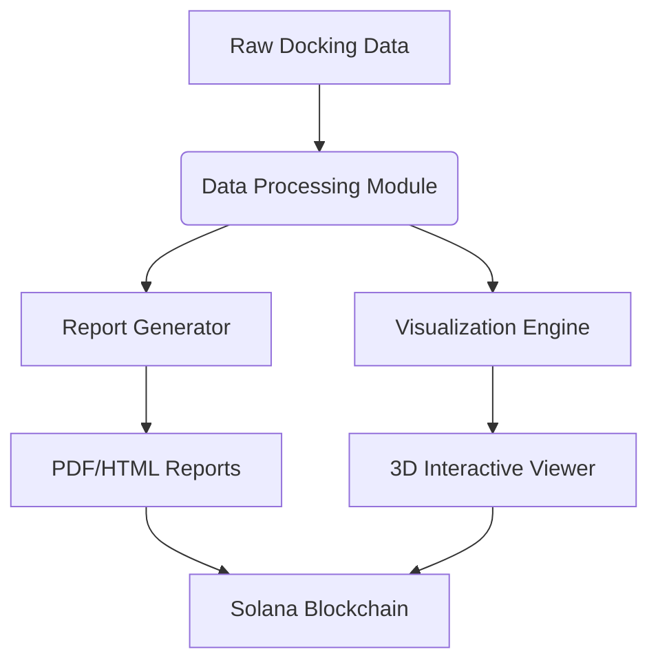

# 🧪 NeuraViva Docking Insight Agent

[](https://opensource.org/licenses/MIT)
[](https://www.python.org/)
[](https://solana.com/)

**An AI-powered framework for automated molecular docking analysis, reporting, and blockchain-secured visualization.**  

---

## 🌟 Overview
The **Docking Insight Agent** transforms raw molecular docking results into **interactive reports, visualizations, and drug efficacy predictions**. Designed for computational drug discovery, it integrates with Solana’s blockchain for **secure, scalable, and tamper-proof data management**.

---

## 🔥 Key Features
| Feature | Description |
|---------|-------------|
| **Automated Reporting** | 📄 Generate PDF/HTML reports with docking scores, binding efficiencies, and drug predictions. |
| **3D Visualization** | 🎨 Interactive molecular binding site explorer with customizable hotspots. |
| **Solana Blockchain** | 🔗 Decentralized data integrity via Solana’s agentic framework. |
| **Modular Design** | ⚙️ Plug-and-play integration with existing drug discovery pipelines. |

---

## 🏗 Architecture


## 🛠 Installation

### 📋 Prerequisites
Ensure you have the following installed:

| Dependency      | Version           | Installation Guide                     |
|-----------------|-------------------|----------------------------------------|
| **Python**      | 3.8 or higher     | [Python Official](https://www.python.org/downloads/) |
| **Node.js**     | 16.x or later     | [Node.js Docs](https://nodejs.org/)    |
| **Solana CLI**  | Latest stable     | [Solana CLI Guide](https://docs.solana.com/cli/install-solana-cli-tools) |
| **Docker**      | (Optional)        | [Docker Docs](https://docs.docker.com/get-docker/) |

---

### 🚀 Step-by-Step Setup

#### 1. **Clone the Repository**
```bash
git clone https://github.com/NeuraViva/docking-insight-agent.git
cd docking-insight-agent
```

# Create and activate a virtual environment
```bash
python -m venv venv
source venv/bin/activate  # Linux/Mac
# For Windows: venv\Scripts\activate
```

# Install Python dependencies
```bash
pip install -r requirements.txt
```

# Run the frontnend
```bash
cd frontend
npm install
cd ..
```

# Configure Solana blockchain
```bash
# Set Solana network (devnet for testing)
solana config set --url devnet

# Verify configuration
solana config get
```

# Run the application 
```bash 
python app.py
```
