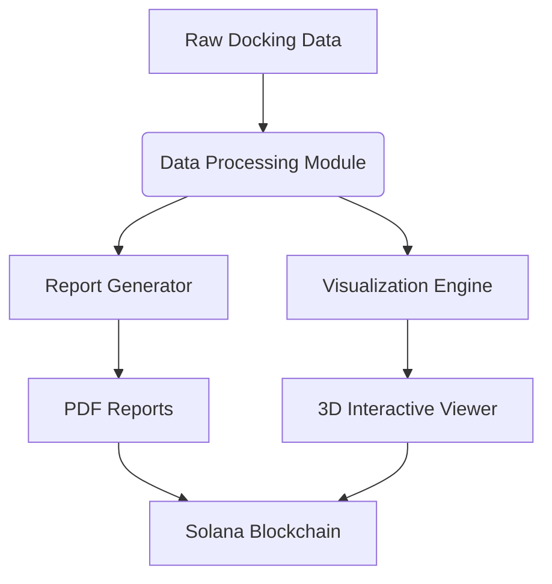

# 🧪 NeuraViva Docking Insight Agent

[](https://opensource.org/licenses/MIT)
[](https://www.python.org/)
[](https://solana.com/)

**An AI-powered framework for automated molecular docking analysis, reporting, and blockchain-secured visualization.**  

https://github.com/user-attachments/assets/552126a2-1620-4116-a899-58d3cb4623ea

## 🌟 Overview
The **Docking Insight Agent** transforms raw molecular docking results into **interactive reports, visualizations, and drug efficacy predictions**. Designed for computational drug discovery, it integrates with Solana’s blockchain for **secure, scalable, and tamper-proof data management**.

---

## 🔥 Key Features
| Feature | Description |
|---------|-------------|
| **Automated Reporting** | 📄 Generate PDF reports with docking scores, binding efficiencies, and drug predictions. |
| **3D Visualization** | 🎨 Interactive molecular binding site explorer with customizable hotspots. |
| **Solana Blockchain** | 🔗 Decentralized data integrity via Solana’s agentic framework. |
---

## 🏗 Architecture


## 🛠 Installation

### 📋 Prerequisites
Ensure you have the following installed:

| Dependency      | Version           | Installation Guide                     |
|-----------------|-------------------|----------------------------------------|
| **Python**      | 3.8 or higher     | [Python Official](https://www.python.org/downloads/) |
| **Node.js**     | 16.x or later     | [Node.js Docs](https://nodejs.org/)    |
| **Solana CLI**  | Latest stable     | [Solana CLI Guide](https://docs.solana.com/cli/install-solana-cli-tools) |

---

### 🚀 Step-by-Step Setup

#### 1. **Clone the Repository**
```bash
git clone https://github.com/piyushjha0409/DockAI
cd DockAI
```

#### 2. Create and activate a virtual environment (Terminal 1)
```bash
cd backend
python -m venv .venv # OR python3 -m venv .venv
source .venv/bin/activate  # Linux/Mac
# For Windows: .venv\Scripts\activate
```

#### 3. Install Python dependencies
```bash
pip install -r requirements.txt
```

#### 4. Run the backend
```bash
uvicorn main:app --reload 
```

#### 5. Run the frontend (Terminal 2)
```bash
cd frontend
npm install
npm run dev
```
#### 6. Access the application
Open your web browser and navigate to `http://localhost:3000` to access the frontend. 

#### 7. Upload your data
For sample data, you can use the provided `sample_data` folder and upload both the files to the application. The application will process the data and generate a report and visualization.
